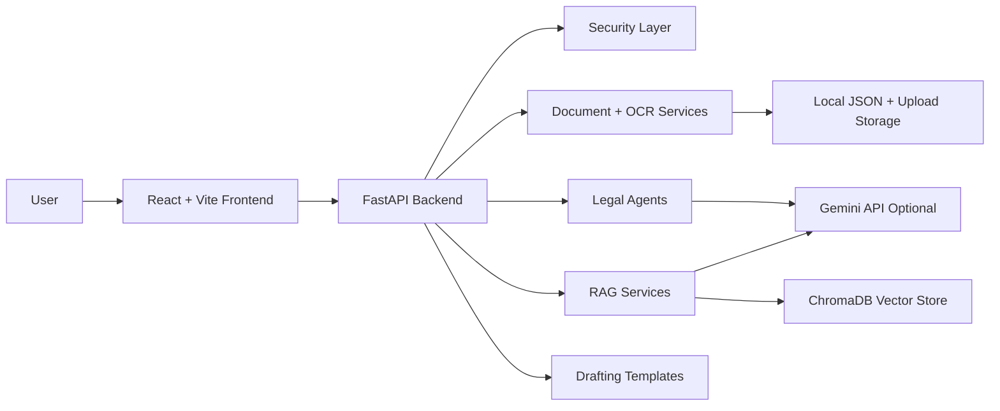
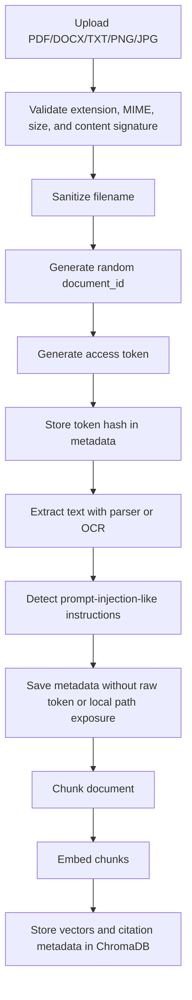
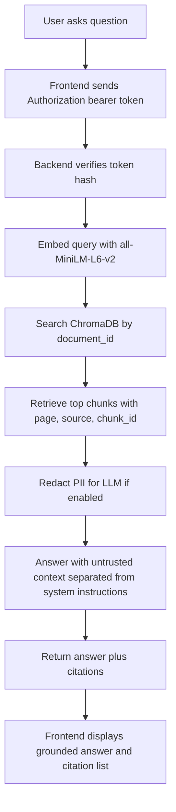
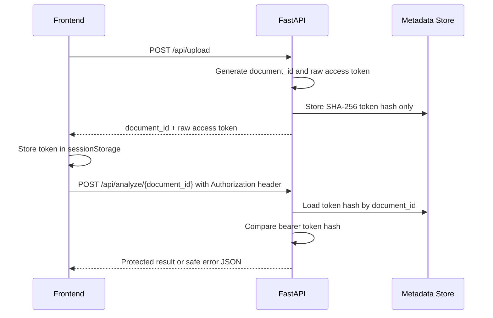
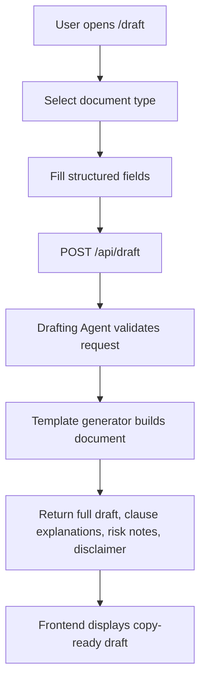

# LegalLens AI Architecture Diagrams

These diagrams describe the current local MVP architecture.

## System Overview

## Upload Pipeline

## RAG Pipeline

## Security and Access Token Flow

## Drafting Pipeline

